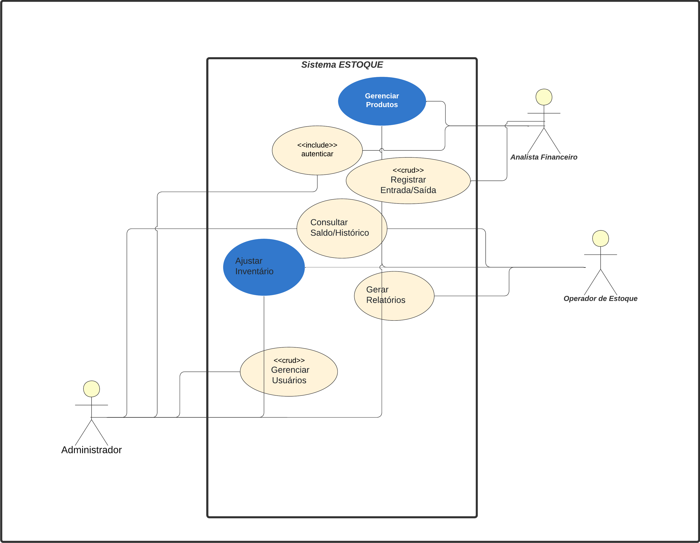
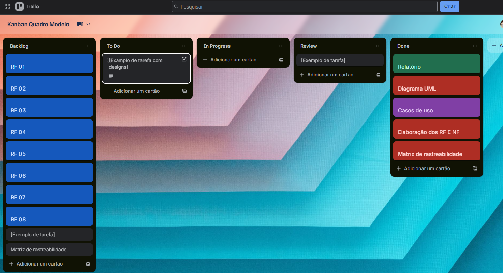
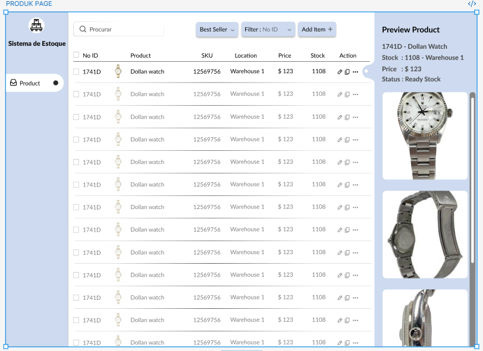
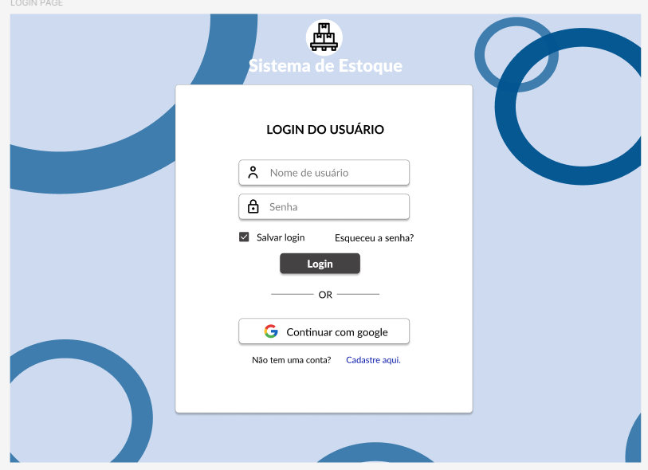

# Documento de Especificação de Requisitos
## Sistema de Gerenciamento de Estoque - Stock Manager

**Equipe:** Antônio Lisboa e Luan Ravel  
**Disciplina:** Manutenção de Software  
**Período:** 2 meses

---

## 1. Introdução do Projeto

Este projeto consiste na manutenção e refatoração do Stock Manager, um sistema web de gerenciamento de estoque que atualmente apresenta falhas críticas que impedem seu funcionamento adequado. O sistema foi desenvolvido utilizando tecnologias modernas como Next.js, React, Express.js e TypeScript, porém encontra-se em estado não funcional, com problemas principalmente no sistema de autenticação e login.

O problema que será resolvido é de natureza crítica, pois sistemas de gerenciamento de estoque são essenciais para o controle eficiente de produtos, movimentações e tomada de decisões estratégicas em empresas. A manutenção de software é uma prática fundamental na indústria de desenvolvimento, sendo responsável por garantir a continuidade, qualidade e evolução de sistemas existentes. Trabalhar com sistemas legados e corrigir problemas críticos é uma necessidade recorrente no ambiente profissional de desenvolvimento de software.

O sistema desenvolvido será uma aplicação web full-stack para gerenciamento completo de estoque, caracterizada por sua arquitetura moderna, interface responsiva baseada em protótipo do Figma, autenticação segura via JWT, controle de acesso por perfis de usuário, gerenciamento de produtos com CRUD completo, controle de movimentações de estoque (entradas, saídas e ajustes), consultas de saldos e histórico, geração de relatórios e exportação de dados.

Os benefícios esperados incluem a transformação de um sistema não funcional em uma aplicação robusta e operacional, código organizado e manutenível seguindo boas práticas, documentação completa que facilita futuras manutenções, experiência de usuário melhorada conforme design moderno, segurança adequada na autenticação e autorização, e base sólida para futuras evoluções e integrações com outros sistemas.

### 1.1. Tema

**Manutenção de Software e Refatoração de Sistema de Gerenciamento de Estoque**

O tema do projeto aborda a manutenção corretiva e evolutiva de software, focando na identificação, correção e melhoria de um sistema existente. Especificamente, trata-se da refatoração completa de um sistema de gerenciamento de estoque, transformando-o de um estado não funcional para uma aplicação robusta e bem documentada.

### 1.2. Objetivo do Projeto

#### Objetivo Geral

Transformar um sistema de gerenciamento de estoque que apresenta falhas críticas em uma aplicação funcional, robusta e bem documentada, seguindo as melhores práticas de desenvolvimento de software e metodologias ágeis.

#### Objetivos Específicos

1. Corrigir problemas críticos do sistema, especialmente o sistema de autenticação e login que atualmente não funciona, eliminando bugs e erros que impedem o funcionamento adequado.

2. Elaborar documentação completa do sistema, incluindo especificação de requisitos funcionais e não funcionais, diagramas de casos de uso e classes da UML, e matriz de rastreabilidade.

3. Implementar interface de usuário baseada no protótipo criado no Figma, garantindo usabilidade, responsividade e alinhamento com o design moderno proposto.

4. Aplicar metodologia Scrum + Kanban para gerenciamento do projeto, organizando sprints e entregas incrementais, mantendo documentação de reuniões e atividades da equipe.

5. Garantir qualidade e boas práticas, implementando tratamento adequado de erros, segurança na autenticação e autorização, e seguindo padrões de código limpo e manutenível.

### 1.3. Delimitação do Problema

O projeto está delimitado à manutenção e refatoração do sistema Stock Manager existente, focando especificamente na correção de problemas críticos, implementação de funcionalidades essenciais de gerenciamento de estoque, e elaboração de documentação completa conforme requisitos da disciplina.

A amplitude do projeto compreende: análise detalhada do código existente e identificação de problemas, correção do sistema de autenticação e login, reorganização e refatoração do código, implementação de CRUD completo de produtos, implementação de controle de movimentações de estoque (entradas, saídas e ajustes), criação de interface baseada no protótipo do Figma, geração de documentação técnica completa (requisitos, diagramas UML, matriz de rastreabilidade), e aplicação de metodologias ágeis (Scrum + Kanban) para organização do trabalho.

Ficam excluídos do escopo atual: integrações com sistemas externos (ERP, contábil), funcionalidades avançadas de relatórios (curva ABC, análises estatísticas complexas), implementação de testes automatizados extensivos, e otimizações avançadas de performance e escalabilidade.

### 1.4. Justificativa da Escolha do Tema

A escolha do tema de manutenção de software justifica-se academicamente pelos seguintes motivos:

**Motivos Teóricos:** A manutenção de software representa uma fase crítica do ciclo de vida de desenvolvimento, compreendendo aproximadamente 60% a 80% do esforço total em projetos de software. Estudar e praticar manutenção permite compreender conceitos fundamentais como refatoração de código, análise de sistemas legados, identificação e correção de bugs, e melhoria contínua de qualidade. Além disso, o trabalho envolve aplicação prática de conhecimentos em engenharia de software, modelagem UML, especificação de requisitos, e metodologias ágeis.

**Motivos Práticos:** Na prática profissional, desenvolvedores frequentemente trabalham com sistemas existentes que necessitam de manutenção, correção de bugs e evolução. Este projeto proporciona experiência real com desafios comuns no ambiente profissional, como compreensão de código legado, identificação de problemas em sistemas não documentados, e aplicação de técnicas de refatoração. O trabalho também desenvolve habilidades em trabalho em equipe, comunicação técnica, e organização de projetos utilizando metodologias ágeis.

**Relevância do Problema:** Sistemas de gerenciamento de estoque são amplamente utilizados em empresas de diversos segmentos, sendo essenciais para operações eficientes. A manutenção e correção de tais sistemas têm impacto direto na produtividade e no controle operacional das organizações, tornando o projeto relevante tanto do ponto de vista acadêmico quanto prático.

### 1.5. Organização do Trabalho

Este documento está organizado da seguinte forma:

**Capítulo 1 - Introdução do Projeto:** Apresenta o projeto, tema, objetivos, delimitação do problema e justificativa.

**Capítulo 2 - Descrição Geral do Sistema:** Descreve o sistema, o problema a ser resolvido, principais envolvidos e regras de negócio.

**Capítulo 3 - Elicitação de Requisitos:** Apresenta as técnicas escolhidas para elicitação, sua aplicação e os resultados obtidos, incluindo listagem de requisitos funcionais e não funcionais.

**Capítulo 4 - Documentação de Casos de Uso:** Descreve os atores do sistema e apresenta o diagrama de casos de uso.

**Capítulo 5 - Diagrama de Classes:** Apresenta o diagrama de classes do sistema.

**Capítulo 6 - Matriz de Rastreabilidade:** Elabora a matriz de rastreabilidade entre requisitos e modelagem.

**Capítulo 7 - Planejamento do Scrum com Trello:** Detalha o planejamento do desenvolvimento utilizando Scrum e Kanban.

**Capítulo 8 - Conclusões:** Apresenta as conclusões gerais do grupo e as percepções individuais de cada aluno.

**Capítulo 9 - Ata de Reunião:** Documenta todas as reuniões da equipe durante o desenvolvimento do projeto.

---

## 2. Descrição Geral do Sistema

### 2.1. Descrição do Problema

O sistema Stock Manager foi desenvolvido como uma aplicação web full-stack para gerenciamento de estoque, porém apresenta diversas falhas críticas que impedem seu uso adequado. O principal problema identificado é a não funcionalidade do sistema de autenticação e login, que é essencial para o acesso às funcionalidades do sistema. Além disso, o código apresenta problemas de organização, duplicação de arquivos, inconsistências na configuração do banco de dados, e falta de documentação adequada.

**Quem é afetado pelo sistema?**

O sistema afeta diretamente empresas que necessitam de controle de estoque, incluindo pequenas e médias empresas de varejo, distribuidoras, e empresas de manufatura. Os usuários impactados são administradores do sistema, operadores de estoque responsáveis pelo cadastro e movimentação de produtos, e profissionais da área financeira que necessitam de relatórios e análises de estoque para tomada de decisões.

**Qual é o impacto do sistema?**

O impacto do sistema não funcional é significativo, pois impede o controle adequado de estoque, gerando problemas operacionais como falta de rastreabilidade de produtos, dificuldade em realizar inventários, impossibilidade de gerar relatórios precisos, e risco de perdas por falta de controle. Por outro lado, quando corrigido e funcional, o sistema proporcionará controle eficiente de estoque, rastreabilidade completa de movimentações, geração de relatórios precisos, e base para tomada de decisões estratégicas.

**Qual seria uma boa solução para o problema?**

A solução proposta envolve manutenção sistemática do sistema, incluindo: correção do sistema de autenticação implementando JWT de forma adequada, refatoração do código eliminando duplicações e organizando a estrutura, configuração adequada do banco de dados MySQL, implementação completa das funcionalidades de CRUD de produtos, desenvolvimento do módulo de controle de movimentações de estoque, criação de interface moderna e responsiva baseada no protótipo do Figma, e documentação completa do sistema. A solução seguirá metodologias ágeis para garantir entregas incrementais e organizadas.

### 2.2. Principais Envolvidos e suas Características

#### 2.2.1. Usuários do Sistema

O sistema destina-se a empresas de diversos segmentos que necessitam de controle de estoque, incluindo empresas de varejo, distribuidoras, empresas de manufatura, e empresas de serviços que trabalham com materiais e produtos. O sistema é adequado tanto para pequenas empresas que precisam de controle básico quanto para empresas médias que necessitam de funcionalidades mais avançadas.

**Tipos de Usuários:**

1. **Administrador do Sistema**
   - Responsável pela configuração e manutenção do sistema
   - Gerencia usuários, permissões e perfis de acesso
   - Configura parâmetros do sistema
   - Acesso total a todas as funcionalidades
   - Características: conhecimento técnico em sistemas, responsável pela segurança e configuração

2. **Operador de Estoque**
   - Responsável pelo cadastro e manutenção de produtos
   - Registra movimentações de entrada e saída de estoque
   - Realiza ajustes de inventário
   - Consulta saldos e histórico de movimentações
   - Características: conhecimento operacional do negócio, uso frequente do sistema, necessidade de interface intuitiva

3. **Analista Financeiro**
   - Consulta relatórios de estoque
   - Exporta dados para análises financeiras
   - Visualiza histórico de movimentações
   - Características: foco em análises e relatórios, uso periódico do sistema, necessidade de dados precisos e exportáveis

### 2.3. Regras de Negócio

**Restrições de Negócio:**

1. Todos os usuários devem estar autenticados para acessar o sistema
2. Apenas administradores podem gerenciar usuários e permissões
3. Produtos devem possuir nome, descrição e preço obrigatórios
4. Movimentações de estoque devem ser registradas com data, quantidade e tipo (entrada, saída ou ajuste)
5. Saldo de estoque não pode ser negativo (exceto em ajustes específicos autorizados)
6. Cada movimentação deve estar associada a um usuário responsável
7. Produtos podem ser categorizados para melhor organização
8. Histórico de movimentações deve ser mantido para auditoria

**Restrições de Desempenho:**

1. Páginas principais devem carregar em menos de 2 segundos (p95)
2. Sistema deve suportar até 10.000 produtos cadastrados
3. Consultas de histórico devem ser otimizadas com paginação
4. Interface deve responder a ações do usuário em menos de 500ms

**Tolerância à Falhas:**

1. Sistema deve manter disponibilidade de 99% mensal
2. Erros de autenticação devem ser tratados adequadamente sem expor informações sensíveis
3. Falhas de comunicação com banco de dados devem ser tratadas com mensagens apropriadas
4. Dados críticos devem ser validados antes de persistência

**Volume de Informação:**

1. Estimativa inicial: até 1.000 produtos cadastrados
2. Estimativa de crescimento: 10% ao mês
3. Movimentações de estoque: estimativa de 500 registros por mês
4. Histórico de movimentações: mantido por 24 meses

**Ferramentas de Apoio:**

1. Sistema de versionamento Git para controle de código
2. GitHub Projects ou Trello para gerenciamento de tarefas
3. Protótipo no Figma como referência de design
4. MySQL como banco de dados principal
5. Postman ou similar para testes de API

---

## 3. Elicitação de Requisitos

### 3.1. Técnicas Escolhidas

#### Ciclo de Vida

O projeto será desenvolvido seguindo um ciclo de vida iterativo e incremental, combinando elementos do modelo em espiral com metodologia ágil Scrum. O ciclo será dividido em fases de análise, design, implementação e testes, executadas de forma iterativa ao longo de sprints de 2 semanas.

**Fases do Ciclo de Vida:**

1. **Fase de Análise e Planejamento (Sprint 1):** Análise do código existente, identificação de problemas, elicitação de requisitos, criação de diagramas UML

2. **Fase de Correção e Refatoração (Sprint 2):** Correção de problemas críticos, refatoração de código, configuração de ambiente

3. **Fase de Implementação (Sprint 3):** Implementação de funcionalidades principais, desenvolvimento de interface

4. **Fase de Testes e Documentação (Sprint 4):** Testes finais, elaboração de documentação completa, preparação para entrega

#### Técnicas de Elicitação de Requisitos

**Técnica 1: Análise de Documentação Existente**

A técnica de análise de documentação existente foi escolhida porque o projeto trata de manutenção de um sistema já desenvolvido. Esta técnica permite identificar requisitos através da análise do código fonte, documentação existente (mesmo que incompleta), comentários no código, e estrutura de arquivos. É adequada para compreender o que foi implementado anteriormente e quais requisitos estavam implícitos no desenvolvimento original.

**Como funciona:** Consiste em examinar sistematicamente o código existente, identificando funcionalidades implementadas, problemas encontrados, e requisitos que podem ser inferidos pela estrutura do sistema. A análise inclui leitura de código, identificação de padrões, e mapeamento de funcionalidades.

**Técnica 2: Brainstorming**

A técnica de brainstorming foi escolhida para complementar a análise de documentação, permitindo que a equipe identifique requisitos adicionais não presentes no código original, melhorias necessárias, e funcionalidades que devem ser implementadas. É útil para explorar soluções criativas e identificar requisitos não óbvios.

**Como funciona:** Consiste em sessões colaborativas onde os membros da equipe geram ideias livremente sobre funcionalidades, melhorias e requisitos do sistema. As ideias são registradas sem crítica inicial, e posteriormente organizadas e priorizadas.

### 3.2. Aplicação das Técnicas

#### Aplicação da Análise de Documentação Existente

A análise de documentação foi realizada através da seguinte metodologia:

1. **Análise do Código Fonte:**
   - Leitura sistemática dos arquivos do frontend (Next.js/React)
   - Análise dos controllers e rotas do backend (Express.js)
   - Identificação de modelos de dados (Sequelize)
   - Mapeamento de funcionalidades implementadas

2. **Análise de Estrutura:**
   - Identificação de pastas duplicadas (`api/` e `backend/`)
   - Análise de configurações de banco de dados
   - Verificação de variáveis de ambiente
   - Identificação de problemas de autenticação

3. **Identificação de Requisitos:**
   - Mapeamento de funcionalidades existentes (mesmo que não funcionais)
   - Identificação de funcionalidades planejadas (comentários, estrutura)
   - Análise do protótipo do Figma para requisitos de interface

**Artefatos Gerados:**
- Lista de funcionalidades identificadas no código
- Mapeamento de problemas encontrados
- Estrutura de dados identificada
- Requisitos inferidos do código

#### Aplicação do Brainstorming

As sessões de brainstorming foram realizadas da seguinte forma:

1. **Sessão 1 - Identificação de Funcionalidades:**
   - Geração de ideias sobre funcionalidades essenciais
   - Identificação de funcionalidades adicionais desejáveis
   - Discussão sobre melhorias de usabilidade

2. **Sessão 2 - Priorização:**
   - Organização das ideias geradas
   - Classificação por prioridade (essencial, importante, desejável)
   - Definição de escopo do projeto

**Artefatos Gerados:**
- Lista de ideias de funcionalidades
- Matriz de priorização
- Requisitos adicionais identificados

**Processo de Elicitação de Requisitos:**

```
┌─────────────────────────────────────────────────────────┐
│                    INÍCIO                               │
└────────────────────┬────────────────────────────────────┘
                     │
                     ▼
┌─────────────────────────────────────────────────────────┐
│  Análise de Documentação Existente                      │
│  - Leitura do código fonte                              │
│  - Análise de estrutura de pastas                       │
│  - Identificação de funcionalidades                     │
└────────────────────┬────────────────────────────────────┘
                     │
                     ▼
┌─────────────────────────────────────────────────────────┐
│  Brainstorming                                          │
│  - Geração de ideias                                    │
│  - Identificação de melhorias                          │
│  - Requisitos adicionais                               │
└────────────────────┬────────────────────────────────────┘
                     │
                     ▼
┌─────────────────────────────────────────────────────────┐
│  Organização e Priorização                             │
│  - Classificação de requisitos                         │
│  - Definição de prioridades                            │
└────────────────────┬────────────────────────────────────┘
                     │
                     ▼
┌─────────────────────────────────────────────────────────┐
│  Documentação de Requisitos                            │
│  - Listagem de RFs                                     │
│  - Listagem de RNFs                                    │
└────────────────────┬────────────────────────────────────┘
                     │
                     ▼
┌─────────────────────────────────────────────────────────┐
│                    FIM                                  │
└─────────────────────────────────────────────────────────┘
```

*Figura 1. Processo de elicitação de requisitos.*

### 3.3. Resultados Obtidos

A análise dos resultados foi realizada através da consolidação das informações obtidas nas duas técnicas aplicadas. Os requisitos identificados na análise de documentação foram complementados com as ideias geradas no brainstorming, resultando em um conjunto inicial de requisitos organizados por prioridade.

Os requisitos foram classificados em três níveis de prioridade: **Essencial** (crítico para o funcionamento básico do sistema), **Importante** (necessário para um sistema completo e funcional), e **Desejável** (melhora a experiência e funcionalidades, mas não é crítico).

#### Tabela 1. Requisitos Funcionais do Sistema

| Código | Descrição | Prioridade |
|--------|-----------|------------|
| RF01 | O sistema deve permitir autenticação de usuários através de email e senha | Essencial |
| RF02 | O sistema deve gerar e validar tokens JWT para controle de sessão | Essencial |
| RF03 | O sistema deve permitir logout e encerramento de sessão | Essencial |
| RF04 | O sistema deve permitir cadastro de novos usuários | Essencial |
| RF05 | O sistema deve permitir criar, listar, buscar, editar e excluir produtos | Essencial |
| RF06 | O sistema deve permitir classificar produtos por categorias | Importante |
| RF07 | O sistema deve permitir registrar entradas de estoque (compras, devoluções) | Essencial |
| RF08 | O sistema deve permitir registrar saídas de estoque (vendas, perdas) | Essencial |
| RF09 | O sistema deve permitir realizar ajustes de inventário (correção de saldos) | Importante |
| RF10 | O sistema deve permitir consultar saldo atual de cada produto | Essencial |
| RF11 | O sistema deve permitir consultar histórico de movimentações por produto | Importante |
| RF12 | O sistema deve permitir pesquisar e filtrar produtos por nome, categoria e estoque | Importante |
| RF13 | O sistema deve permitir gerar relatórios de estoque atual | Importante |
| RF14 | O sistema deve permitir gerar relatórios de movimentações por período | Importante |
| RF15 | O sistema deve permitir exportar relatórios em formato CSV ou JSON | Desejável |
| RF16 | O sistema deve permitir cadastro e gerenciamento de fornecedores | Desejável |
| RF17 | O sistema deve permitir relacionar produtos a fornecedores | Desejável |
| RF18 | O sistema deve permitir gerenciar usuários (criar, editar, ativar, desativar) | Importante |
| RF19 | O sistema deve implementar controle de acesso por perfis (Administrador, Operador, Financeiro) | Importante |
| RF20 | O sistema deve registrar auditoria de operações (usuário, ação, data) | Importante |

#### Tabela 2. Requisitos Não-Funcionais do Sistema

| Código | Descrição | Categoria | Prioridade |
|--------|-----------|-----------|------------|
| RNF01 | O sistema deve utilizar comunicação HTTPS em produção | Segurança | Essencial |
| RNF02 | O sistema deve proteger endpoints com autenticação JWT | Segurança | Essencial |
| RNF03 | O sistema deve sanitizar todas as entradas do usuário para prevenir ataques | Segurança | Essencial |
| RNF04 | O sistema deve armazenar senhas utilizando hash bcrypt | Segurança | Essencial |
| RNF05 | O sistema deve implementar controle de acesso baseado em perfis de usuário | Segurança | Importante |
| RNF06 | O sistema deve ter disponibilidade de 99% mensal | Confiabilidade | Importante |
| RNF07 | O sistema deve ter tempo de resposta de páginas principais inferior a 2 segundos (p95) | Desempenho | Importante |
| RNF08 | O sistema deve suportar até 10.000 produtos cadastrados | Desempenho | Importante |
| RNF09 | O sistema deve ter interface responsiva funcionando em dispositivos móveis, tablets e desktops | Usabilidade | Importante |
| RNF10 | O sistema deve seguir padrões de acessibilidade web (WCAG) | Usabilidade | Desejável |
| RNF11 | O sistema deve ter interface intuitiva e fácil de usar, seguindo o protótipo do Figma | Usabilidade | Importante |
| RNF12 | O sistema deve gerar logs de requisições e erros para observabilidade | Implementação | Importante |
| RNF13 | O sistema deve ser compatível com navegadores modernos (Chrome, Firefox, Safari, Edge) | Implementação | Essencial |
| RNF14 | O sistema deve utilizar API REST com formato JSON | Implementação | Essencial |
| RNF15 | O sistema deve ter interface em português brasileiro (pt-BR) | Implementação | Essencial |

---

## 4. Documentação de Casos de Uso

### 4.1. Atores

#### Tabela 3. Atores do Sistema

| # | Ator | Definição |
|---|------|-----------|
| 1 | Administrador | Usuário responsável pela configuração e manutenção do sistema. Gerencia usuários, permissões, perfis de acesso e configurações gerais. Possui acesso total a todas as funcionalidades do sistema. |
| 2 | Operador de Estoque | Usuário responsável pelo cadastro e manutenção de produtos, registro de movimentações de estoque (entradas, saídas e ajustes), e consulta de saldos e histórico. É o principal usuário operacional do sistema. |
| 3 | Analista Financeiro | Usuário responsável por consultar relatórios de estoque, exportar dados para análises financeiras, e visualizar histórico de movimentações. Possui acesso apenas a funcionalidades de consulta e relatórios. |

### 4.2. Diagrama de Caso de Uso

O diagrama de casos de uso apresenta as funcionalidades do sistema e suas relações com os atores. O sistema possui fronteira bem definida, separando o sistema de estoque dos atores externos (Administrador, Operador de Estoque e Analista Financeiro).

O diagrama inclui relacionamentos de associação entre atores e casos de uso, relacionamentos de herança (Administrador e Operador herdam funcionalidades de autenticação), relacionamentos de inclusão (<<include>>) onde um caso de uso sempre inclui outro, e relacionamentos de extensão (<<extend>>) onde um caso de uso pode estender outro opcionalmente.

**Principais casos de uso identificados:**

- **Autenticar:** Caso de uso fundamental incluído por outros casos que requerem autenticação
- **Gerenciar Produtos:** Inclui criação, listagem, edição e exclusão de produtos
- **Registrar Entrada/Saída:** Casos de uso que sempre incluem consulta de produtos
- **Ajustar Inventário:** Permite correção de saldos após contagem física
- **Consultar Saldo/Histórico:** Permite visualização de estoque atual e histórico
- **Gerar Relatórios:** Pode ser estendido pela exportação de dados
- **Gerenciar Usuários:** Exclusivo para administradores



*Figura 2. Diagrama de Caso de Uso (representação textual - diagrama UML deve ser criado em ferramenta apropriada)*

**Descrição dos relacionamentos:**

- **Autenticar <<include>> Gerenciar Usuários:** Gerenciar usuários sempre requer autenticação
- **Gerenciar Produtos <<include>> Registrar Entrada:** Registrar entrada sempre consulta produtos
- **Gerenciar Produtos <<include>> Registrar Saída:** Registrar saída sempre consulta produtos
- **Gerenciar Produtos <<include>> Ajustar Inventário:** Ajustar inventário sempre consulta produtos
- **Gerar Relatórios <<extend>> Exportar Dados:** Exportar dados estende opcionalmente a geração de relatórios

---

## 5. Diagrama de Classes

O diagrama de classes apresenta a estrutura estática do sistema, mostrando as classes principais, seus atributos, métodos e relacionamentos. O sistema possui classes de domínio (User, Product, Category, Supplier, StockMovement), classes de serviço (AuthService, ProductService, StockService, ReportService), e enums (Role, MovementType).

**Principais classes:**

- **User:** Representa usuários do sistema com autenticação e perfil
- **Product:** Representa produtos cadastrados no sistema
- **Category:** Representa categorias para organização de produtos
- **Supplier:** Representa fornecedores de produtos
- **StockMovement:** Representa movimentações de estoque (entradas, saídas, ajustes)

**Principais relacionamentos:**

- User possui relacionamento 1:N com StockMovement (um usuário realiza várias movimentações)
- Product possui relacionamento 1:N com StockMovement (um produto tem várias movimentações)
- Product possui relacionamento N:1 com Category (vários produtos pertencem a uma categoria)
- Product possui relacionamento N:N com Supplier (vários produtos podem ter vários fornecedores)

```
┌─────────────────────────────────────────────────────────────────┐
│                       DIAGRAMA DE CLASSES                       │
│                                                                  │
│  ┌──────────────┐         ┌──────────────┐                      │
│  │    User      │         │    Role      │                      │
│  ├──────────────┤         ├──────────────┤                      │
│  │+id: number   │         │ADMIN         │                      │
│  │+email: string│         │OPERATOR      │                      │
│  │+passwordHash │         │FINANCE       │                      │
│  │+role: Role   │         └──────────────┘                      │
│  └──────┬───────┘                                               │
│         │                                                        │
│         │ 1                                                     │
│         │                                                       │
│         │ *                                                     │
│  ┌──────▼──────────────┐                                       │
│  │ StockMovement       │                                       │
│  ├─────────────────────┤                                       │
│  │+id: number          │                                       │
│  │+type: MovementType  │                                       │
│  │+date: Date          │                                       │
│  │+quantity: number    │                                       │
│  │+unitPrice: number   │                                       │
│  │+notes: string       │                                       │
│  └──────┬──────────────┘                                       │
│         │                                                       │
│         │ *                                                     │
│         │                                                       │
│         │ 1                                                     │
│  ┌──────▼──────────────┐                                       │
│  │     Product         │                                       │
│  ├─────────────────────┤                                       │
│  │+id: number          │                                       │
│  │+name: string        │                                       │
│  │+description: string │                                       │
│  │+price: number       │                                       │
│  │+imageUrl: string   │                                       │
│  │+stockQuantity: number                                       │
│  └──────┬──────────────┘                                       │
│         │                                                       │
│         │ *                                                     │
│         │                                                       │
│         │ 1                                                     │
│  ┌──────▼──────────────┐                                       │
│  │    Category         │                                       │
│  ├─────────────────────┤                                       │
│  │+id: number          │                                       │
│  │+name: string        │                                       │
│  └─────────────────────┘                                       │
│                                                                  │
│  ┌──────────────┐                                               │
│  │   Supplier   │                                               │
│  ├──────────────┤                                               │
│  │+id: number   │                                               │
│  │+name: string │                                               │
│  │+documentId   │                                               │
│  │+contactEmail │                                               │
│  └──────┬───────┘                                               │
│         │                                                        │
│         │ * (N:N via ProductSupplier)                           │
│         │                                                        │
│         │ *                                                     │
│  ┌──────▼──────────────┐                                       │
│  │     Product         │                                       │
│  └─────────────────────┘                                       │
│                                                                  │
│  ┌──────────────────────┐                                       │
│  │   AuthService       │                                       │
│  ├─────────────────────┤                                       │
│  │+login(email, pwd)   │                                       │
│  │+register(user)     │                                       │
│  └─────────────────────┘                                       │
│                                                                  │
│  ┌──────────────────────┐                                       │
│  │   ProductService    │                                       │
│  ├─────────────────────┤                                       │
│  │+createProduct()     │                                       │
│  │+updateProduct()     │                                       │
│  │+deleteProduct()     │                                       │
│  │+listProducts()      │                                       │
│  └─────────────────────┘                                       │
│                                                                  │
│  ┌──────────────────────┐                                       │
│  │   StockService       │                                       │
│  ├─────────────────────┤                                       │
│  │+registerEntry()     │                                       │
│  │+registerExit()      │                                       │
│  │+adjustInventory()   │                                       │
│  └─────────────────────┘                                       │
│                                                                  │
│  ┌──────────────────────┐                                       │
│  │   ReportService      │                                       │
│  ├─────────────────────┤                                       │
│  │+stockSnapshot()     │                                       │
│  │+movementsByPeriod() │                                       │
│  └─────────────────────┘                                       │
└─────────────────────────────────────────────────────────────────┘
```

*Figura 3. Diagrama de Classes (representação textual - diagrama UML deve ser criado em ferramenta apropriada)*

---

## 6. Matriz de Rastreabilidade

A matriz de rastreabilidade estabelece a relação entre requisitos funcionais (RF) e requisitos não funcionais (RNF), bem como entre requisitos e elementos de modelagem (casos de uso e classes do diagrama de classes).

A matriz permite verificar se todos os requisitos foram contemplados na modelagem e identificar possíveis lacunas ou inconsistências. A relação é marcada com "X" quando há dependência entre requisitos ou quando um requisito é implementado através de um elemento de modelagem.

### Matriz RF x RF (Dependências entre Requisitos Funcionais)

|       | RF01 | RF02 | RF03 | RF04 | RF05 | RF06 | RF07 | RF08 | RF09 | RF10 | RF11 | RF12 | RF13 | RF14 | RF15 | RF16 | RF17 | RF18 | RF19 | RF20 |
|-------|------|------|------|------|------|------|------|------|------|------|------|------|------|------|------|------|------|------|------|------|
| RF01  |  -   |  X   |  X   |  X   |  X   |  X   |  X   |  X   |  X   |  X   |  X   |  X   |  X   |  X   |  X   |  X   |  X   |  X   |  X   |  X   |
| RF02  |  X   |  -   |  X   |  -   |  X   |  X   |  X   |  X   |  X   |  X   |  X   |  X   |  X   |  X   |  X   |  X   |  X   |  X   |  X   |  X   |
| RF03  |  X   |  X   |  -   |  -   |  -   |  -   |  -   |  -   |  -   |  -   |  -   |  -   |  -   |  -   |  -   |  -   |  -   |  -   |  -   |  -   |
| RF04  |  X   |  -   |  -   |  -   |  -   |  -   |  -   |  -   |  -   |  -   |  -   |  -   |  -   |  -   |  -   |  -   |  -   |  -   |  -   |  -   |
| RF05  |  X   |  X   |  -   |  -   |  -   |  X   |  X   |  X   |  X   |  X   |  X   |  X   |  X   |  X   |  -   |  -   |  -   |  -   |  -   |  X   |
| RF06  |  X   |  X   |  -   |  -   |  X   |  -   |  -   |  -   |  -   |  -   |  X   |  -   |  -   |  -   |  -   |  -   |  -   |  -   |  -   |  -   |
| RF07  |  X   |  X   |  -   |  -   |  X   |  -   |  -   |  -   |  -   |  X   |  -   |  X   |  -   |  X   |  -   |  -   |  -   |  -   |  -   |  X   |
| RF08  |  X   |  X   |  -   |  -   |  X   |  -   |  -   |  -   |  -   |  X   |  -   |  X   |  -   |  X   |  -   |  -   |  -   |  -   |  -   |  X   |
| RF09  |  X   |  X   |  -   |  -   |  X   |  -   |  -   |  -   |  -   |  X   |  -   |  X   |  -   |  X   |  -   |  -   |  -   |  -   |  -   |  X   |
| RF10  |  X   |  X   |  -   |  -   |  X   |  -   |  X   |  X   |  X   |  -   |  -   |  X   |  -   |  -   |  -   |  -   |  -   |  -   |  -   |  -   |
| RF11  |  X   |  X   |  -   |  -   |  X   |  X   |  X   |  X   |  X   |  X   |  -   |  X   |  -   |  X   |  -   |  -   |  -   |  -   |  -   |  X   |
| RF12  |  X   |  X   |  -   |  -   |  X   |  X   |  -   |  -   |  -   |  -   |  -   |  -   |  -   |  -   |  -   |  -   |  -   |  -   |  -   |  -   |
| RF13  |  X   |  X   |  -   |  -   |  X   |  -   |  X   |  X   |  X   |  X   |  -   |  -   |  -   |  -   |  -   |  -   |  -   |  -   |  -   |  -   |
| RF14  |  X   |  X   |  -   |  -   |  X   |  -   |  X   |  X   |  X   |  X   |  X   |  -   |  -   |  -   |  -   |  -   |  -   |  -   |  -   |  X   |
| RF15  |  X   |  X   |  -   |  -   |  -   |  -   |  -   |  -   |  -   |  -   |  -   |  X   |  X   |  -   |  -   |  -   |  -   |  -   |  -   |  -   |
| RF16  |  X   |  X   |  -   |  -   |  -   |  -   |  -   |  -   |  -   |  -   |  -   |  -   |  -   |  -   |  -   |  -   |  X   |  -   |  -   |  -   |
| RF17  |  X   |  X   |  -   |  -   |  X   |  -   |  -   |  -   |  -   |  -   |  -   |  -   |  -   |  -   |  -   |  X   |  -   |  -   |  -   |  -   |
| RF18  |  X   |  X   |  -   |  -   |  -   |  -   |  -   |  -   |  -   |  -   |  -   |  -   |  -   |  -   |  -   |  -   |  -   |  -   |  X   |  X   |
| RF19  |  X   |  X   |  -   |  -   |  X   |  X   |  X   |  X   |  X   |  X   |  X   |  X   |  X   |  X   |  X   |  X   |  X   |  X   |  -   |  X   |
| RF20  |  X   |  X   |  -   |  -   |  X   |  X   |  X   |  X   |  X   |  X   |  X   |  X   |  X   |  X   |  X   |  X   |  X   |  X   |  X   |  -   |

### Matriz RF x Modelagem (Casos de Uso)

| Requisito | Autenticar | Gerenciar Usuários | Gerenciar Produtos | Registrar Entrada | Registrar Saída | Ajustar Inventário | Consultar Saldo/Histórico | Gerar Relatórios | Exportar Dados |
|-----------|------------|-------------------|-------------------|-------------------|-----------------|-------------------|--------------------------|-----------------|----------------|
| RF01      | X          | -                 | -                 | -                 | -               | -                 | -                        | -               | -              |
| RF02      | X          | -                 | -                 | -                 | -               | -                 | -                        | -               | -              |
| RF03      | X          | -                 | -                 | -                 | -               | -                 | -                        | -               | -              |
| RF04      | X          | X                 | -                 | -                 | -               | -                 | -                        | -               | -              |
| RF05      | -          | -                 | X                 | -                 | -               | -                 | -                        | -               | -              |
| RF06      | -          | -                 | X                 | -                 | -               | -                 | -                        | -               | -              |
| RF07      | -          | -                 | -                 | X                 | -               | -                 | -                        | -               | -              |
| RF08      | -          | -                 | -                 | -                 | X               | -                 | -                        | -               | -              |
| RF09      | -          | -                 | -                 | -                 | -               | X                 | -                        | -               | -              |
| RF10      | -          | -                 | -                 | -                 | -               | -                 | X                        | -               | -              |
| RF11      | -          | -                 | X                 | -                 | -               | -                 | X                        | -               | -              |
| RF12      | -          | -                 | -                 | -                 | -               | -                 | -                        | X               | -              |
| RF13      | -          | -                 | -                 | -                 | -               | -                 | -                        | X               | -              |
| RF14      | -          | -                 | -                 | -                 | -               | -                 | -                        | -               | X              |
| RF15      | -          | -                 | -                 | -                 | -               | -                 | -                        | -               | -              |
| RF16      | -          | -                 | -                 | -                 | -               | -                 | -                        | -               | -              |
| RF17      | -          | -                 | X                 | -                 | -               | -                 | -                        | -               | -              |
| RF18      | -          | X                 | -                 | -                 | -               | -                 | -                        | -               | -              |
| RF19      | -          | X                 | X                 | X                 | X               | X                 | X                        | X               | X              |
| RF20      | -          | X                 | X                 | X                 | X               | X                 | X                        | X               | X              |

### Matriz RF x Modelagem (Classes)

| Requisito | User | Product | Category | Supplier | StockMovement | AuthService | ProductService | StockService | ReportService |
|-----------|------|---------|----------|----------|---------------|-------------|----------------|-------------|---------------|
| RF01      | X    | -       | -        | -        | -             | X           | -              | -           | -             |
| RF02      | X    | -       | -        | -        | -             | X           | -              | -           | -             |
| RF03      | X    | -       | -        | -        | -             | X           | -              | -           | -             |
| RF04      | X    | -       | -        | -        | -             | X           | -              | -           | -             |
| RF05      | -    | X       | -        | -        | -             | -           | X              | -           | -             |
| RF06      | -    | X       | X        | -        | -             | -           | X              | -           | -             |
| RF07      | X    | X       | -        | -        | X             | -           | -              | X           | -             |
| RF08      | X    | X       | -        | -        | X             | -           | -              | X           | -             |
| RF09      | X    | X       | -        | -        | X             | -           | -              | X           | -             |
| RF10      | -    | X       | -        | -        | X             | -           | -              | -           | X             |
| RF11      | -    | X       | X        | -        | -             | -           | X              | -           | -             |
| RF12      | -    | X       | -        | -        | X             | -           | -              | -           | X             |
| RF13      | -    | X       | -        | -        | X             | -           | -              | -           | X             |
| RF14      | -    | X       | -        | -        | X             | -           | -              | -           | X             |
| RF15      | -    | X       | -        | -        | -             | -           | -              | -           | -             |
| RF16      | -    | -       | -        | X        | -             | -           | -              | -           | -             |
| RF17      | -    | X       | -        | X        | -             | -           | X              | -           | -             |
| RF18      | X    | -       | -        | -        | -             | -           | -              | -           | -             |
| RF19      | X    | X       | X        | X        | X             | X           | X              | X           | X             |
| RF20      | X    | X       | -        | -        | X             | -           | X              | X           | X             |

*Figura 4. Matriz de Rastreabilidade*

---

## 7. Planejamento do Scrum com Trello

### 7.1. Metodologia Adotada

O projeto utiliza uma abordagem híbrida combinando Scrum e Kanban para gerenciamento ágil. O Scrum fornece a estrutura de sprints, cerimônias e papéis, enquanto o Kanban oferece visualização contínua do fluxo de trabalho através de um board.

### 7.2. Estrutura Scrum

**Sprints:** O projeto será dividido em 4 sprints de 2 semanas cada, totalizando 8 semanas (2 meses).


### 7.3. Board Kanban

O board Kanban está organizado nas seguintes colunas:

- **Backlog:** Todas as tarefas identificadas e priorizadas
- **To Do:** Tarefas a serem iniciadas no sprint atual
- **In Progress:** Trabalho em andamento
- **Review:** Código/documentação em revisão
- **Done:** Tarefas concluídas

### 7.4. Link do Trello

O quadro Kanban do projeto está disponível no Trello e compartilhado com a professora e monitora da disciplina.



---

## 8. Conclusões

### 8.1. Conclusão Geral do Grupo

O projeto de manutenção do sistema Stock Manager proporcionou experiência valiosa em manutenção de software, demonstrando a importância de análise sistemática, documentação adequada e aplicação de metodologias ágeis. A transformação de um sistema não funcional em uma aplicação robusta requer compreensão profunda do código existente, identificação precisa de problemas, e execução cuidadosa de refatorações.

Os principais aprendizados incluem a compreensão de que manutenção de software é uma atividade complexa que vai além de simples correção de bugs, envolvendo análise de arquitetura, refatoração de código, e melhoria contínua. A aplicação de metodologias ágeis (Scrum + Kanban) facilitou a organização do trabalho e permitiu entregas incrementais, enquanto a documentação completa (requisitos, diagramas UML, matriz de rastreabilidade) garante manutenibilidade futura do sistema.

O trabalho também evidenciou a importância de boas práticas de desenvolvimento desde o início, pois problemas arquiteturais e falta de documentação dificultam significativamente a manutenção. A experiência prática com ferramentas modernas (Next.js, React, Express, TypeScript) e metodologias ágeis prepara adequadamente para o ambiente profissional de desenvolvimento de software.

### 8.2. Percepção Individual

**Percepção do Aluno 1 - Antônio Lisboa:**

Este projeto foi extremamente enriquecedor para minha formação como Ciêntista de computação. A experiência de trabalhar com um sistema legado e transformá-lo em uma aplicação funcional me proporcionou insights valiosos sobre a realidade do desenvolvimento de software. Aprendi que a manutenção de software requer paciência, análise cuidadosa e atenção aos detalhes.

A parte mais desafiadora foi compreender o código existente sem documentação adequada, o que me ensinou a importância de documentar código durante o desenvolvimento. A aplicação prática de conceitos de engenharia de software, como especificação de requisitos, modelagem UML e rastreabilidade, consolidou conhecimentos teóricos de forma significativa.

O trabalho em equipe utilizando metodologias ágeis foi uma experiência positiva, mostrando como ferramentas como Trello e práticas do Scrum podem organizar e facilitar o desenvolvimento. A experiência me preparou para enfrentar desafios similares no ambiente profissional, onde a manutenção de sistemas existentes é uma realidade constante.

**Percepção do Aluno 2 - Luan Ravel:**

A participação neste projeto de manutenção de software foi fundamental para minha compreensão prática da engenharia de software. Trabalhar com um sistema não funcional e transformá-lo em uma aplicação robusta me permitiu vivenciar desafios reais do desenvolvimento profissional.

Uma das maiores lições aprendidas foi a importância da análise sistemática antes de iniciar correções. A identificação de problemas através de técnicas de elicitação de requisitos e a criação de diagramas UML me ajudaram a compreender melhor a arquitetura do sistema e planejar as refatorações necessárias.

A experiência com metodologias ágeis, especialmente o uso do Kanban no Trello, demonstrou como a organização visual do trabalho pode melhorar significativamente a produtividade e o acompanhamento do progresso. A documentação completa do projeto, incluindo a matriz de rastreabilidade, me mostrou a importância de manter rastreabilidade entre requisitos e implementação.

O projeto consolidou meus conhecimentos em tecnologias modernas como Next.js, React e Express, e me preparou para trabalhar em equipe em projetos de software. A experiência prática com manutenção de código legado é uma habilidade essencial que levarei para minha carreira profissional.

---

## 9. Ata de Reunião

### Reunião 1 - Kickoff do Projeto
**Data:** 27/10/25  
**Duração:** 2 horas  
**Participantes:** Antônio Lisboa, Luan Ravel

**Pauta:**
- Apresentação do projeto e objetivos
- Análise inicial do código existente
- Identificação de problemas principais
- Definição de metodologia de trabalho (Scrum + Kanban)
- Criação do board no Trello
- Divisão inicial de tarefas

**Decisões:**
- Utilizar Scrum com sprints de 2 semanas
- Criar board Kanban no Trello para gerenciamento
- Priorizar correção do sistema de autenticação
- Documentar todas as reuniões e decisões

**Ações:**
- [ ] Antônio: Analisar código do frontend e identificar problemas
- [ ] Luan: Analisar código do backend e identificar problemas
- [ ] Ambos: Criar board no Trello e estruturar backlog inicial

---

### Reunião 2 - Análise de Requisitos
**Data:** 28/10/25  
**Duração:** 1h30min  
**Participantes:** Antônio Lisboa, Luan Ravel

**Pauta:**
- Apresentação dos problemas identificados
- Elicitação de requisitos utilizando brainstorming
- Priorização de requisitos funcionais e não funcionais
- Definição de escopo do projeto

**Decisões:**
- Lista inicial de 20 requisitos funcionais
- Lista inicial de 15 requisitos não funcionais
- Foco em funcionalidades essenciais primeiro
- Funcionalidades desejáveis podem ser implementadas se houver tempo

**Ações:**
- [ ] Antônio: Documentar requisitos funcionais
- [ ] Luan: Documentar requisitos não funcionais
- [ ] Ambos: Revisar e validar requisitos

---

### Reunião 3 - Modelagem UML
**Data:** 29/10/25  
**Duração:** 2 horas  
**Participantes:** Antônio Lisboa, Luan Ravel

**Pauta:**
- Definição de atores do sistema
- Criação de diagrama de casos de uso
- Criação de diagrama de classes
- Validação dos diagramas

**Decisões:**
- 3 atores principais: Administrador, Operador de Estoque, Analista Financeiro
- 10+ casos de uso identificados
- 8+ classes no diagrama de classes
- Utilizar ferramenta apropriada para criação dos diagramas UML

**Ações:**
- [ ] Antônio: Criar diagrama de casos de uso
- [ ] Luan: Criar diagrama de classes
- [ ] Ambos: Revisar e validar diagramas

---

### Reunião 4 - Planejamento de Sprints
**Data:** 30/10/25   
**Duração:** 1h30min  
**Participantes:** Antônio Lisboa, Luan Ravel

**Pauta:**
- Planejamento do Sprint 1 (Análise e Planejamento)
- Definição de tarefas e estimativas
- Atualização do board Trello
- Definição de critérios de aceitação

**Decisões:**
- Sprint 1 focado em análise e documentação
- Tarefas distribuídas entre os membros da equipe
- Revisão diária do progresso

**Ações:**
- [ ] Antônio: Atualizar Trello com tarefas do Sprint 1
- [ ] Luan: Revisar e validar tarefas
- [ ] Ambos: Iniciar execução das tarefas

---

### Reunião 5 - Sprint Review 1
**Data:** 02/11/25    
**Duração:** 1 hora  
**Participantes:** Antônio Lisboa, Luan Ravel

**Pauta:**
- Revisão do trabalho realizado no Sprint 1
- Apresentação dos resultados
- Identificação de bloqueios e problemas
- Planejamento do Sprint 2

**Decisões:**
- Sprint 1 concluído com sucesso
- Documentação de requisitos e diagramas finalizados
- Sprint 2 focado em correção de problemas críticos

**Ações:**
- [ ] Ambos: Iniciar Sprint 2 - Correção de problemas críticos

###Figma




